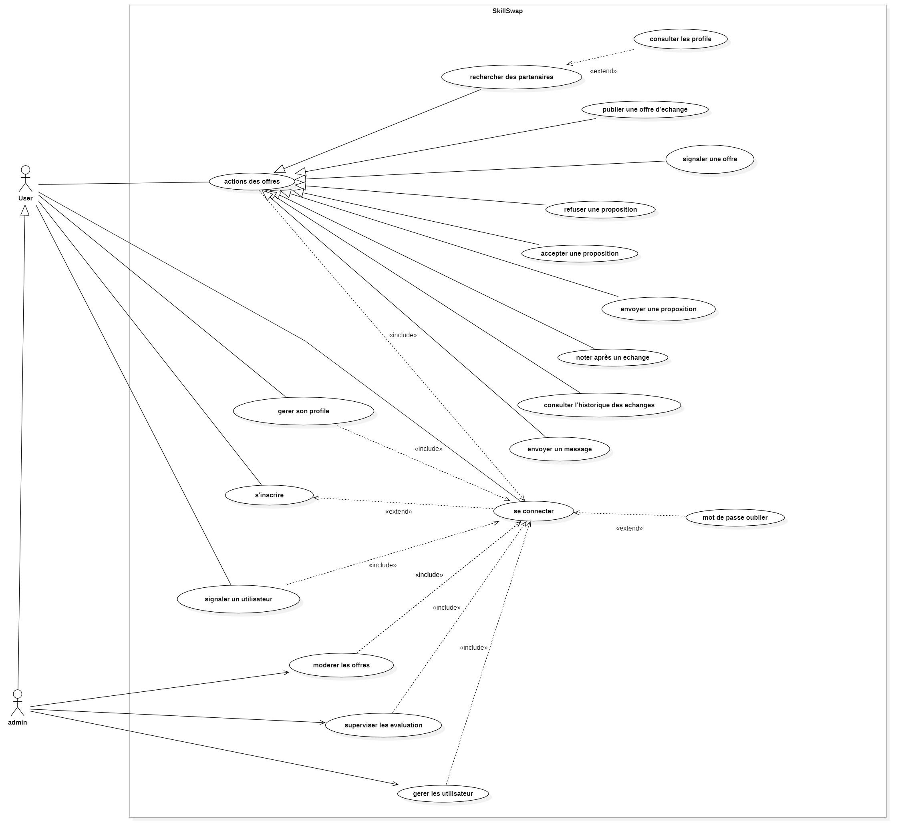
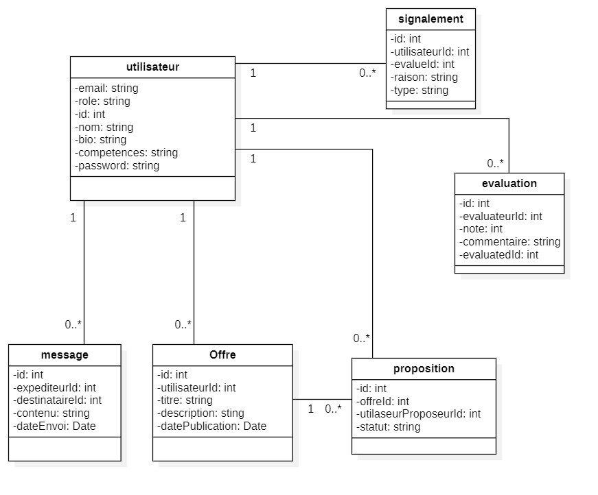

# SkillSwap – README

## Table des matières

1. [Présentation du projet](#présentation-du-projet)
2. [Problèmes à résoudre](#problèmes-à-résoudre)
    - [Problèmes rencontrés](#problèmes-rencontrés)
    - [Besoins exprimés](#besoins-exprimés)
3. [Utilisateurs cibles et rôles](#utilisateurs-cibles-et-rôles)
    - [Lien avec les technologies](#lien-avec-les-technologies)
4. [Fonctionnalités](#fonctionnalités)
    - [Utilisateur simple](#utilisateur-simple)
    - [Administrateur](#administrateur)
5. [User Stories](#user-stories)
    - [User Stories pour l’utilisateur](#User-Stories-pour-lutilisateur)
    - [User Stories pour l’administrateur ](#User-Stories-pour-ladministrateur)
6. [Priorisation des fonctionnalités](#priorisation-des-fonctionnalités)
7. [Planification du projet](#planification-du-projet)
   - [Liste des tâches à réaliser](#liste-des-tâches-à-réaliser)
   - [Outils nécessaires au développement](#outils-nécessaires-au-développement)
   - [Outils nécessaires à lexploitation](#outils-nécessaires-à-lexploitation)
8. [Contraintes techniques](#contraintes-techniques)
9. [UML](#uml)
10. [Mockup](#mockup)
## Présentation du projet

**Nom du projet** : SkillSwap  
**Description** : Plateforme web permettant aux utilisateurs d’échanger des compétences entre eux, sans paiement.  
**Objectif principal** : Faciliter le partage de savoir-faire entre particuliers via un système de troc de compétences.

---

## Problèmes à résoudre

### Problèmes rencontrés :
- Difficulté à trouver des cours personnalisés ou abordables.
- Peu de plateformes favorisent l’échange mutuel de compétences sans paiement.

### Besoins exprimés :
- Offrir un espace simple et gratuit pour apprendre et enseigner entre particuliers.
- Permettre aux utilisateurs de proposer des échanges (ex : “je t’aide en anglais, tu m’aides en Photoshop”).

---

##  Utilisateurs cibles et rôles

| Type d'utilisateur | Description | Rôles et permissions |
|--------------------|-------------|-----------------------|
| **Utilisateur inscrit** | Membre de la plateforme | - Gérer son profil - Publier des offres d’échange - Rechercher des partenaires - Envoyer/recevoir des propositions - Utiliser la messagerie - Noter après un échange |
| **Admin** | Gestionnaire de la plateforme | - Gérer les utilisateurs - Modérer les offres - Supprimer le contenu abusif - Superviser les évaluations |

### Lien avec les technologies
- **Laravel** : Middleware `auth`, `role`, Policies
- **React** : Routes protégées selon les rôles

---

## Fonctionnalités

###  Utilisateur simple
- Inscription / Connexion
- Création & gestion de profil
- Publication d’offres d’échange
- Recherche de partenaires par compétence
- Envoi de propositions d’échange
- Messagerie privée
- Évaluation post-échange

### Administrateur
- Gestion des utilisateurs
- Suppression / modification d’offres
- Supervision des évaluations

---

##  User Stories

### User Stories pour l’utilisateur
 - En tant qu’utilisateur, je souhaite m’inscrire sur la plateforme afin de créer un compte et commencer à utiliser SkillSwap.

- En tant qu’utilisateur, je souhaite me connecter à mon compte afin d’accéder à mes fonctionnalités personnalisées.

- En tant qu’utilisateur, je souhaite réinitialiser mon mot de passe si je l’ai oublié afin de pouvoir récupérer l’accès à mon compte.

- En tant qu’utilisateur, je souhaite gérer mon profil afin de mettre à jour mes informations personnelles et mes compétences.

- En tant qu’utilisateur, je souhaite rechercher des partenaires afin de trouver des personnes avec qui échanger des compétences.

- En tant qu’utilisateur, je souhaite consulter les profils d'autres utilisateurs afin d’évaluer les partenaires potentiels.

- En tant qu’utilisateur, je souhaite publier une offre d’échange afin de proposer mes compétences à la communauté.

- En tant qu’utilisateur, je souhaite signaler une offre si je la juge inappropriée ou abusive.

- En tant qu’utilisateur, je souhaite envoyer une proposition à un autre utilisateur afin de démarrer un échange de compétences.

- En tant qu’utilisateur, je souhaite accepter une proposition reçue si elle m’intéresse.

- En tant qu’utilisateur, je souhaite refuser une proposition reçue si elle ne me convient pas.

- En tant qu’utilisateur, je souhaite envoyer un message à un autre utilisateur afin de communiquer avec lui directement.

- En tant qu’utilisateur, je souhaite consulter l’historique de mes échanges afin de suivre mes expériences passées.

- En tant qu’utilisateur, je souhaite noter un utilisateur après un échange afin d’aider la communauté à juger de sa fiabilité.

- En tant qu’utilisateur, je souhaite signaler un utilisateur en cas de comportement inapproprié.

### User Stories pour l’administrateur
- En tant qu’administrateur, je souhaite modérer les offres publiées afin de garantir le respect des règles de la plateforme.

- En tant qu’administrateur, je souhaite superviser les évaluations laissées par les utilisateurs afin de prévenir les abus.

- En tant qu’administrateur, je souhaite gérer les utilisateurs afin de suspendre ou supprimer les comptes qui ne respectent pas les règles.

---

## Priorisation des fonctionnalités

| Fonctionnalité | Priorité |
|----------------|----------|
| Inscription/Connexion | 🟢 Essentielle |
| Gestion de profil | 🟢 Essentielle |
| Recherche et filtrage | 🟢 Essentielle |
| Envoi de propositions | 🟢 Essentielle |
| Notation/commentaire | 🟡 Secondaire |
| Tableau de bord admin | 🟢 Essentielle |
| Statistiques détaillées | 🟠 Bonus |

---

## Contraintes techniques

- **Frameworks** : Laravel (Backend), React (Frontend)
- **Base de données** : MySQL
- **Hébergement prévu** : Hostinger
- **Responsive** : Compatible PC, tablette et mobile

---

## Planification du Projet 

---

### Liste des tâches à réaliser

#### Conception (4 jours)
- Création des diagrammes UML (cas d'utilisation, classes, séquence)
- Réalisation des maquettes des interfaces clés 
- Définition de l’architecture du projet 

#### Développement Back-End (6 jours)
- Initialisation du projet Laravel + configuration de la base de données
- Implémentation de l’authentification (inscription, connexion, middleware)
- Création des modèles, contrôleurs, routes API (utilisateurs, offres, demandes)
- Gestion des permissions via Policies (rôles : utilisateur, admin)

#### Développement Front-End (6 jours)
- Initialisation du projet React avec Vite
- Création des pages principales : Accueil, Connexion, Tableau de bord, Offres
- Connexion à l’API + affichage conditionnel selon les rôles

#### Tests (2 jours)
- Tests fonctionnels sur les formulaires, les échanges et les connexions
- Vérification des validations côté front et back
- Tests de sécurité 
#### Déploiement (2 jours)
- Préparation de la version de production
- Déploiement du back-end et front-end sur Hostinger
- Tests post-déploiement 

---
###  Outils nécessaires au développement

#### Langages & Frameworks
- **Back-End** : PHP (Laravel)
- **Front-End** : JavaScript (React)
- **Base de données** : MySQL

#### Environnement de développement
- IDE : Visual Studio Code
- Serveur local : XAMPP
- Navigateurs de test : Chrome, Firefox, Edge

#### Versioning & collaboration
- Git (en local)
- GitHub (hébergement distant du code)

#### Design & UI
- StarUML pour les diagrammes
- Figma pour les maquettes
- Tailwind CSS/ Bootstrap pour le style
- FontAwesome / Lucide Icons pour les icônes

---

### Outils nécessaires à l’exploitation

| Besoin                         | Solution prévue                        |
|--------------------------------|----------------------------------------|
| **Hébergement**                | Hostinger                              |
| **Monitoring & logs**          | Laravel Log     |
| **Sauvegarde base de données** | Automatisée via Hostinger              |
| **Sécurité**                   | Certificat SSL/TLS (Hostinger), pare-feu intégré |

---
## UML
- **Use Case Diagram** :

- **Class Diagram** :

## Mockup
[Voir les maquettes](https://www.canva.com/design/DAGnFUj42a8/8tJjEplQASyJ2i_3fCdNvg/view)
